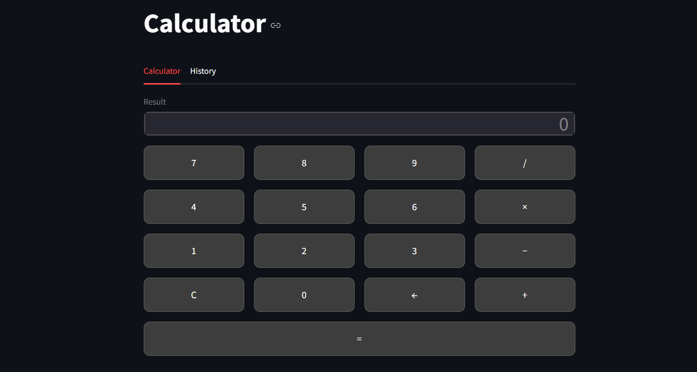

# 🧮 Styled Streamlit Calculator

A simple and interactive calculator built with **Streamlit**, featuring a clean UI, custom styling, and calculation history.

## 🚀 Features

- Basic operations: addition, subtraction, multiplication, division
- Custom styled UI (CSS)
- Calculation history tab
- Smart input behavior:
  - New number resets after calculation
  - Operators continue from result
- Backspace and clear functionality

## 📸 Preview



## 🛠️ Tech Stack

- Python
- Streamlit

## 📦 Installation

Clone the repository:

```bash
git clone https://github.com/YOUR_USERNAME/styled-streamlit-calculator.git
cd streamlit-calculator
pip install streamlit
streamlit run app.py
